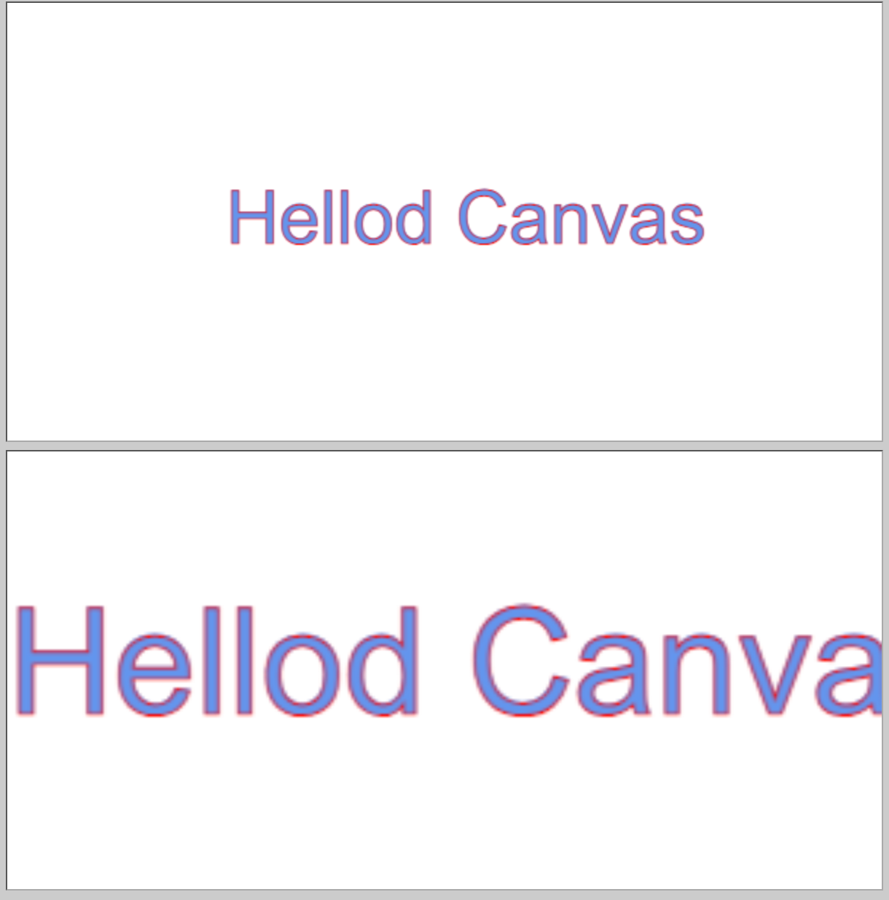

## Canvas


### 一、基础知识

canvas的核心是他的context，context本质上是一个绘图环境，相当于是一个画板。

```html
<canvas>
	该浏览器不支持canvas
</canvas>
```

canvas中间的内容是一个后备内容，在当前的html环境**不支持canvas元素**的时候会显示该内容

#### 1.1canvas神奇的宽高（CSS设置宽高）

*canvas的默认元素大小是300✖️150*，可以使用canvas标签的属性width、height来控制，也可以使用css来控制，**但是在用css控制时会产生意外的后果**



​																			图1.1

canvas是一个特殊的元素，他其实是**相当于两个部分的合集**，元素大小和画板context大小，默认情况下元素和画板大小都是300✖️150的，我们在元素上设置width和height属性相当于*同时修改元素和画板大小*，**CSS的修改只针对画板**，所以如上图1.1，上册图片是在属性上设置width600，height300的效果，下方是只设置css的效果，看起来**只设置css等同于缩放**

#### 1.2Canvas元素的API

> Canvas元素只有两个熟悉和三个方法

##### 属性

| 属性    | 类型     | 默认值 |
| ------- | -------- | ------ |
| width   | 非负整数 | 300    |
| heitght | 非负整数 | 150    |

方法


| 属性                            | 描述                                                         |
| ------------------------------- | ------------------------------------------------------------ |
| getContext(type, attribute)     | 获取canvas的上下文（画板）context                            |
| toDataURL(type, encoderOptions) | 返回一个包含图片展示的 [data URI](https://developer.mozilla.org/zh-CN/docs/Web/HTTP/Basics_of_HTTP/Data_URLs) 。可以使用 `type` 参数其类型，默认为 [PNG](https://en.wikipedia.org/wiki/Portable_Network_Graphics) 格式。图片的分辨率为 96dpi。 |
| toBlob(callback, type, quality) | 创造 [`Blob`](https://developer.mozilla.org/zh-CN/docs/Web/API/Blob) 对象，用以展示 canvas 上的图片 |

##### 1.3Context对象的属性

| 属性                    | 简介                                                   |
| ----------------------- | ------------------------------------------------------ |
| canvas                  | 这个绘图环境所属的canvas元素                           |
| fillstyle               | 指定该绘图环境后续填充操作所使用的颜色、渐变色或图案   |
| font                    | 指使用fillText和strokeText方法时所使用的字型           |
| globalAlpha             | 指定全局透明度0-1                                      |
| globalCompsiteOperation | 指定了将某个物体绘制到其他物体之上时，所采用的绘制方式 |
| lineCap                 | 指定了线段的首尾端端绘制方式                           |
| lineWidth               | 指定了线段的宽度，是个非负非无穷的值                   |
| lineJoin                | 指定了两个线段的交汇处的绘制方式                       |
| miterLimit              | 告诉浏览器如何绘制miter形式的线段焦点                  |

