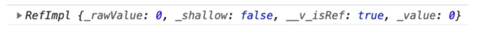
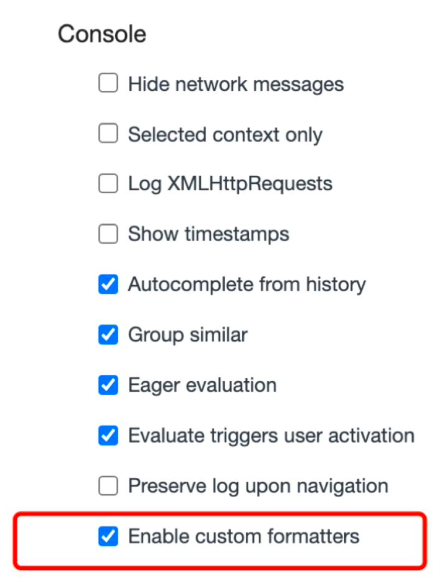
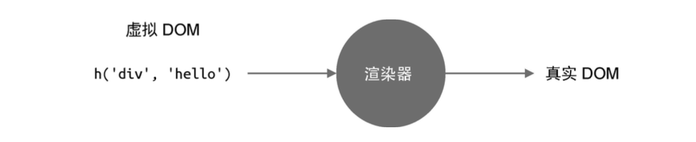
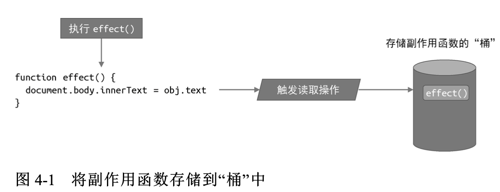
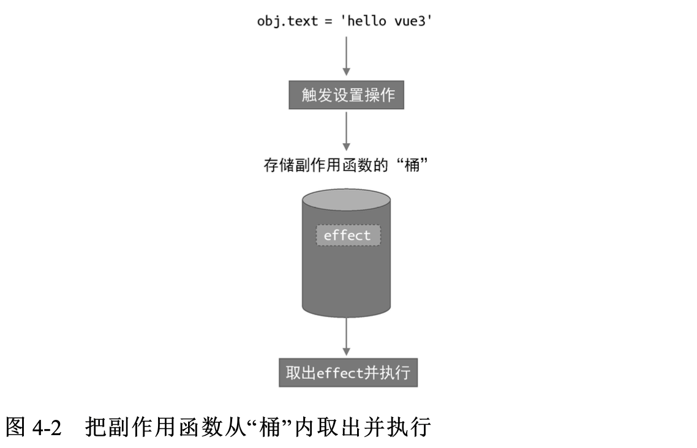
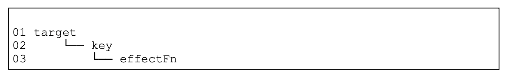
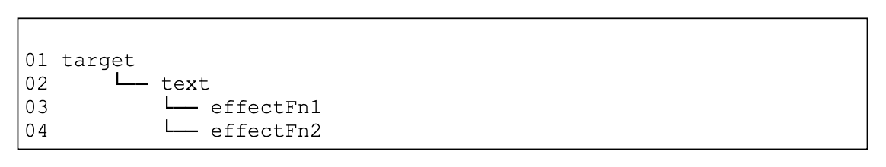
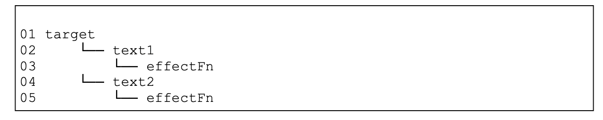
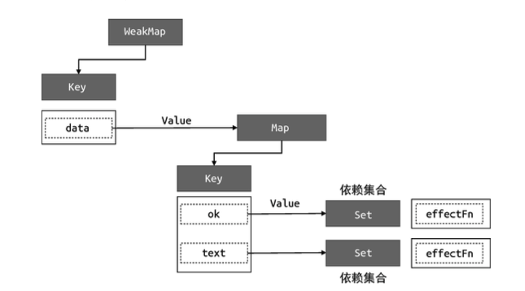
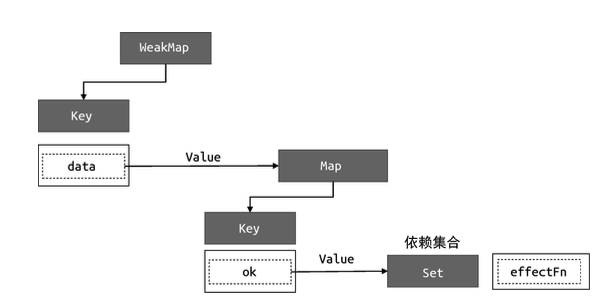

## Vue的设计与实现

### 一、框架设计

> Vue3是一款声明式框架

#### 1.1为什么选择声明式

声明式的选择主要体现在性能与可维护性上的权衡，jquery是典型的命令式框架。

命令式框架和声明式框架在性能上的差异主要体现在修改时，命令式框架可以直观的进行对应位置的修改操作，但是声明式框架要先去寻找要修改的位置，再进行修改，我们把修改的性能消耗定义为A，找出差异的为B

命令式的更新性能消耗为A

声明式的更新性能消耗为A+B

所以声明式的 性能消耗一定是高于命令式的，既然声明式的性能消耗更高为什么还要选择声明式呢？这是因为声明式的代码的可维护性更高，并且极致优化的命令式代码很难书写，并且只要我们让性能消耗B尽可能的减小，那么我们在性能上的差距就可以无限贴近于命令式。

#### 1.2为什么选择运行时+编译时

编译时的架构是指将一段代码直接编译成命令式代码，运行时的架构是指将一段代码通过一个黑盒进行运行，然后再生成命令式代码执行，vue3提供了编译时➕运行时的模式，让我们可以在写类似于html的模版或者直接写树形结构调用Render函数，还是提高了可维护性和书写的便捷性

编译时的优点：因为对代码进行了编译工作，所以可以对用户提供的内容进行分析

### 二、框架设计的核心

#### 2.1提升用户的体验

会用console.warn来反馈出一些方便定位问题所在的信息

小tip：

在我们打印ref数据时，console.log(ref(0))控制台的输出一般是2-1这个样子的



​        	                                              图 2-1

这个显示是不直观的，浏览器支持我们自定义编写formatter从而自定义输出形式，在vue3中可以搜索到initCustomFormatter的函数，该函数就是用于开发环境初始化自定义formatter的，可以在设置中打开



​              	                                              图 2-2

这样我们再打印时可以得到直观的内容


#### 2.2控制框架代码的体积

##### 2.2.1剔除不必要的调试体验代码

因为要提高用户体验，所以框架在设计的时候会有很多的用于发出警告和检查的代码，但这些代码在生产环境中时不需要的，vue在做这个设计的时候采用了环境变量判断的模式

```js
if (__DEV__ && !res) {
  warn(
  	`Faild to mount app......`
  )
}
```

可以看到\__DEV__环境变量在开发环境下为true，在生产环境下为false，如果为false这段代码就永远不会执行了，在用rollup.js进行打包的时候就会被移除，有效的减少了生产环境下的代码体积

##### 2.2.2剔除不必要的废代码或无意义代码

```js
export const isHTMLTag = /*#__PURE__*/ makeMap(HTML_TAGS)
```

也会用/\*#\__PURE__*/来表示这个函数没有副作用，如果该函数只是读一个结果，并且该结果没有赋值给别的单位，最终也会被删除

##### 2.2.3剔除没用的功能代码

框架在设计时会随着更新的迭代产生一些废弃的api，在我们明确我们项目中没有使用时，可以通过相应的配置进行删除处理，例如vue3中如果我们明确我们使用的是Composition API就可以用\__VUE_OPTIONS_API__开关来关闭选项式API的特性，从而减小代码体积

#### 2.3 错误处理

提供统一的错误处理函数

#### 2.4良好的TS支持

### 三、Vue.js 3的设计思路

#### 3.1 声明式地描述UI

> 编写前端页面要涉及的内容
>
> 1、DOM元素
>
> 2、元素的属性
>
> 3、元素的事件
>
> 4、元素的层级结构

Vue选择了和原生基本一致的描述方式来进行**模版**的书写，当然我们也可以用js对象的方式来描述

##### 3.1.1模版描述ui

```vue
<templete>
  <div class="dom" :id="coustomId" @click="handler">
  	<div />
  </div>
</templete>
```

##### 3.1.2js对象描述ui

```js
const vnode = {
  // 标签名称
  tag: 'div',
  // 标签属性
  props: {
    class: 'dom',
    id: coustomId
    onClick: handler
  },
  // 子节点
  children: [
    { tag: 'div' }
  ]
}
export default {
  render() {
    return vnode
  }
}

```

利用h函数

```js
import { h } from 'vue'
export default {
  render () {
    return h('h1', { onClick:handler })
  }
}
```

#### 3.2初始渲染器

Vue先通过渲染函数(.render ) 拿到虚拟DOM，之后再通过渲染器将虚拟DOM转化为真实DOM，如图3-1所示



​														图3-1

```js
const vnode = {
  // 标签名称
  tag: 'div',
  // 标签属性
  props: {
    class: 'dom',
    onClick: handler
  },
  // 子节点
  children: 'click me'
}
export default {
  render() {
    return title
  }
}		
```

先解释一下上面的代码：

- tag用来描述标签名称，所以div就是一个\<div>标签
- props是一个对象，用来描述\<div>标签的属性、事件等内容
- children用来描述标签的子节点，上面代码中是一个字符串，所以代码\<div>有一个文本节点

接下来我们实现一个渲染器

```js
function renderer (vnode, container) {
  const { tag, props, children} = vnode
  // 生成DOM节点
  const el = document.createElement(tag)
  // 处理props属性
  for ( const key in props) {
    // 如果是on开头说明是事件
    if(/^on/.test(key)) {
      el.addEventListener(key.slice(2).toLowerCase(), props[key])
    } else {
      el.setAttribute(key, props[key])
    }
  }
  // 处理children
  if (typeof children === 'string') el.appendChild(document.createTextNode(children))
  else if (Array.isArray(children)) children.forEach(child => renderer(child, el))
  container.appendChild(el)
}
```

当然这只是首次渲染，渲染器复杂的地方在于更新阶段，例如文本内容的变更从click me变更为 click again，渲染器应该只更新元素的文本内容，而不需要走一遍完整的创建过程

#### 3.3组件的本质

组件的本质就是DOM元素的封装，有点像js中的fragment切片，所以我们可以定义一个函数，函数的返回值就是这个页面要渲染的内容

```js
const MyComponent =function () {
  return {
    tag: 'div',
    props: {
      onClick: () => alert(1)
    },
    children: 'click me'
  }
}
```

重构渲染器renderer函数的tag处理部分

```js
function renderer (vnode, container) {
  // 是dom节点
  if (typeof vnode.tag === 'string') mountElement(vnode, container)
  // 是组件节点
  else if (typeof vnode.tag === 'function') mountComponent(vnode, container)
}
```

**mountElement**是之前的renderer函数

```js
function mountElement (vnode, container) {
  const { tag, props, children} = vnode
  // 生成DOM节点
  const el = document.createElement(tag)
  // 处理props属性
  for ( const key in props) {
    // 如果是on开头说明是事件
    if(/^on/.test(key)) {
      el.addEventListener(key.slice(2).toLowerCase(), props[key])
    } else {
      el.setAttribute(key, props[key])
    }
  }
  // 处理children
  if (typeof children === 'string') el.appendChild(document.createTextNode(children))
  else if (Array.isArray(children)) children.forEach(child => renderer(child, el))
  container.appendChild(el)
}
```

**mountComponent**如下，主要是为了生成虚拟DOM，然后再去调用renderer

```js
function mountComponent (vnode, container) {
  // 获取虚拟DOM
  const sunTree = vnode.tag()
  renderer(sunTree, container)
}
```

当然我们知道的Vue的组件展示形式是一个对象，所以最终**renderer、mountComponent**应该是下方这个样子的

**renderer**如下

```js
function renderer (vnode, container) {
  // 是dom节点
  if (typeof vnode.tag === 'string') mountElement(vnode, container)
  // 是组件节点
  else if (typeof vnode.tag === 'object') mountComponent(vnode, container)
}
```

**mountComponent** 如下

```js
function mountComponent (vnode, container) {
  // 获取虚拟DOM
  const sunTree = vnode.tag.render()
  renderer(sunTree, container)
}	
```

#### 3.4模版的工作原理

模版的工作原理其实主要是借助于编辑器，我们知道在写vue时会导出一个对象，编译器让模版生成作用的原理就是在导出的对象上生成一个render函数，返回vnode，**并在进行分析时，将可能发生变化的数据在vnode中标识出来，方便渲染器进行更新时找到哪个地方可能发生变化**

```js
{
  render () {
    return {
      tag: 'div',
      props: {
        id: 'foo',
        class: cls
      },
      patchFlags: 1 //假设数字1代表class是动态的
    }
  }
}
```

### 四、响应系统的作用与实现

#### 4.1响应式数据和副作用函数

> 副作用函数

所谓副作用函数是指改变了这个函数作用域范围外的数据的值，且这个值可以在其他作用域内访问，例如

```js
function effect () {
	document.body.innerText = 'Hello vue3'
}
```

这段代码中body是可以被除了effect意外的任何函数所访问，对外界产生了影响，所有effect函数产生了副作用

> 响应式

响应式数据就是值某个数据变量被用于了某个副作用函数中，我们希望这个响应式数据改变时，使用这个响应式数据的副作用函数重新执行一遍

```js
const obj = { text: 'hello word' }
function effect () {
	document.body.innerText = obj.text
}
// 我们期望当obj的text值改变时，effect函数可以重新执行一遍
```

#### 4.2响应式数据的基本实现

```js
const obj = { text: 'hello word' }
function effect () {
	document.body.innerText = obj.text
}
```

通过观察上述代码可以看到响应式数据主要会发生两个事情

- 副作用函数effect执行会读取响应式数据的值
- 响应式数据的值修改了，会触发document.body.innerText的设置操作

要实现响应式数据，我们就需要对一个数据的读取和设置进行拦截操作，当我们读区响应式数据obj.text时，我们可以把副作用函数effect存储到一个桶里，如图4-1所示



接着当设置obj.text时，再把副作用函数从effect桶里拿出来并执行即可，如图4-2



在这个响应式的过程中有三个比较重要的元素：

- 被读取的代理对象obj
- 被操作的字段text
- 被执行的副作用函数effect

明确了这个关系，那我们就可以把三者联系起来建立如下的关系



其中为了避免混淆effect，我们之后称effect为注册副作用函数的一个函数，如果一个字段有两个对应的副作用函数

```js
effect(function effectFn1 () {
  obj.text
})
effect(function effectFn2 () {
  obj.text
})
```

那么关系如下



如果一个副作用函数读取了两个字段

```js
effect(function effectFn () {
  obj.text1
  obj.text2
})
```

那么关系如下



明确了这个联系的树形结构，那么我们就可以开始设计我们桶的数据结构了，为了能有一一对应的关系，所以我们采用WeakMap来作为桶的数据结构

```js
// 当前的副作用
let activeEffect = null
// 注册副作用的函数
const effect = ( fn ) => {
  activeEffect = fn
  activeEffect()
}
// 储存副作用函数的桶
const bucket = new WeakMap ()
const data = { text: 'hello Word' }
const obj = new Proxy ( data, {
  // 拦截读取操作
  // 1、看桶中是否有这个target绑定的字段集合，没有创建
  // 2、看字段集合里有没有这个字段，没有创建
  // 3、给这个字段副作用集合添加新的副作用
  get (target, key) {
    // 在桶中添加依赖关系
    track(target, key)
    return target[key]
  },
  // 拦截操作
  // 1、设置新值
  // 2、从桶中取出target对应的字段集合
  // 3、从字段集合中取出副作用集合
  // 4、执行所有的副作用
  set (target, key, newValue) {
    // 根据依赖关系从桶中取出副作用执行
    target[key] = newValue
    trigger(target, key)
  }
})
const track = (target, key) => {
  if (!activeEffect) return
  // 1、看桶中是否有这个target绑定的字段集合，没有创建
  let depMap = bucket.get(target)
  if (!depMap) bucket.set(target, (depMap = new Map ()))
  // 2、看字段集合里有没有这个字段，没有创建
  let deps = depMap.get(key)
  if(!deps) depMap.set(key, (deps = new Set ()))
  // 3、给这个字段副作用集合添加新的副作用
  deps.add(activeEffect)
}
const trigger = (target, key) => {
  const depMap = bucket.get(target)
  if (!depMap) return
  const deps = depMap.get(key)
  deps && deps.forEach(fn => fn())
}
```

#### 4.3分支切换与cleanup

首先我们来明确一下副作用依赖关系的收集过程，整体可以分为3个部分，副作用函数开始执行，副作用函数执行，副作用函数执行完毕副作用函数执行的过程形成了依赖关系，因为在这个时间段会触发响应式数据的get拦截，从而将副作用函数的key和副作用函数进行绑定


我们再来聊一下分支切换

```js
const data = {
  ok: true,
  text: 'hello word'
}
const obj = new Proxy(data,{/* ...*/})
effect(() => {
  document.body.innerText = obj.ok ? obj.text : 'not'
})
```

如上代码所示，在obj.ok为true时，obj的属性ok和text都绑定了该副作用函数，也就是说，ok和text的值改变都会再次执行该副作用函数




但是当obj的属性ok为false时，应当只有ok绑定该副作用函数，这个就是分支切换，



我们之前实现的响应式结构并不能实现这一过程，在之前的响应式结构中，如果第一次obj.ok为true会使得ok和text的属性都绑定上该副作用函数，当obj.ok为false的时候不会删除掉obj.text的绑定，其实换个角度去想，如果每一次副作用函数的执行都删除以前的依赖关系，重新绑定这个问题就解决了，因为obj.ok为true时，副作用函数的执行会读取ok和text两个熟悉的值，而依赖的收集就发生在读取值的过程，所以两个属性都绑定上了，当ob j.ok的值是false时，只会读取ok的值，那就只有ok和该函数绑定上了，所以当副作用再次执行时，我们只需要在开始执行前先将之前和这个副作用函数有关系的依赖关系都清除，这样在他执行时会重新绑定依赖关系。

明确了我们要做的事情，在副作用函数开始执行前删除之前的依赖关系，为了做这个事情，我们需要在执行前得到这个依赖关系，依赖关系的收集过程发生在响应式的get阶段，所以我们要先去get阶段将依赖的绑定双向收集，代码改造如下

```js
const track = (target, key) => {
  if (!activeEffect) return
  // 1、看桶中是否有这个target绑定的字段集合，没有创建
  let depMap = bucket.get(target)
  if (!depMap) bucket.set(target, (depMap = new Map ()))
  // 2、看字段集合里有没有这个字段，没有创建
  let deps = depMap.get(key)
  if(!deps) depMap.set(key, (deps = new Set ()))
  // 3、给这个字段副作用集合添加新的副作用
  deps.add(activeEffect)
  activeEffect.deps.push(deps) //分支切换新增
}
```

之后我们要在副作用函数执行前去清空之前的依赖关系，代码如下

```js
function effect (fn) {
  activeEffect = () => {
    cleanup(activeEffect)
    fn()
  }
  activeEffect.deps = []
  activeEffect()
}
function cleanup (effectFn) {
  for(let i=0; i<effectFn.deps.length; i++){
    const deps = effectFn.deps[i]
    deps.delete(effectFn)
  }
  effectFn.deps = []
}
```

在进行到这里我们已经解决了分支切换的问题，但我们执行会发现页面卡死了，这个问题主要是因为trigger函数的问题

```js
const trigger = (target, key) => {
  const depMap = bucket.get(target)
  if (!depMap) return
  const deps = depMap.get(key)
  deps && deps.forEach(fn => fn()) // 问题所在
}
```

trigger函数中deps的forEach执行会出现死循环，是因为我们在副作用函数fn中的cleanup里把deps中的该项清除掉了，但是在执行阶段，响应式数据的get阶段触发又加了回来，以至于deps中不断的减和加，一直执行不完，我们只需要在deps遍历之前深拷贝一份，之后执行拷贝的这个deps就好了

```js
const trigger = (target, key) => {
  const depMap = bucket.get(target)
  if (!depMap) return
  const deps = depMap.get(key)
  const effectsToRun = new Set(deps) // 新增
  effectsToRun.forEach(effectFn => effectFn()) // 新增
}
```

#### 4.4嵌套的effect与effect栈

