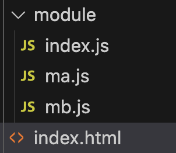
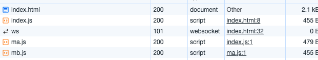

## Webpack

### 一、Webpack核心功能

#### 1、浏览器中的模块化

目前新版的浏览器已经对模块化有了一定程度上的支持```<script type="module" src="./module/index.js"></script>```只需要再type上声明module即可在js中使用ESmodule，但是浏览器的模块化伴随着一定的问题，我们做个实验



Index.html文件中用模块化的方式引入index.js

```html
<!DOCTYPE html>
<html lang="en">
<head>
  <meta charset="UTF-8">
  <meta name="viewport" content="width=device-width, initial-scale=1.0">
  <title>Document</title>
</head>
<body>
  <script type="module" src="./module/index.js"></script>
</body>
</html>
```

Index.js文件引入模块ma

```js
import a from './ma.js'
console.log('入口')
```

ma.js文件中导出"a"，并引入模块mb

```js
import b from './mb.js'
console.log('加载了ma')
export default 'a'
```

Mb.js文件中导出"b"

```js
console.log('加载了mb')
export default 'b'
```

最终浏览器控制台的效果如下


看起来一切正常，先加载了mb文件，之后ma文件，最后是index文件

我们再看一下浏览器的网络模块



可以发现我们发送了5个请求，其中ws可以忽略，是websocket请求，因为测试，用了livesever，实际的请求只有四个，分别是index.html、index.js、ma.js、mb.js，根据请求可知，我们有多少个模块文件就会去请求多少个js文件，我们都知道在前端性能优化上，网络请求是占据很重的比例的，**这会导致很严重的性能问题，降低了页面访问效率**

除此之外，浏览器在兼容性上还存在着部分问题，并在在浏览器上是没有办法使用npm包的

总结：

- 性能问题
  - 会发送很多的模块js文件加载请求
- 兼容问题
  - 浏览器不支持CommonJs规范
- 无法使用npm包
  - 浏览器的Esmodule的引入只支持./和../开头

#### 2、webpack的安装和使用

###### 安装

```js
npm i -D webpack webpack-cli
```

###### 使用

```js
webpack
```

默认会以./src/index.js作为文件入口进行依赖分析，打包到./dist/main.js

#### 3、模块化的兼容性

###### 3.1CommonJs的模块化

```js
module.export = {
  a: 1,
  b: 2,
  c: 3
}
```

###### 3.2Esmodule的模块化

```js
export var a = 1
export var b = 2
export default 3
```

###### 3.3兼容

Esmodule导出，Commonjs导入

```js
const esmodule = require('./a')
// esmodule => {
                  a: 1,
                  b: 2,
                  default: 3
                }
```

Commonjs导出，Esmodule导入

```js
import common from './b'
//	common => {
								a: 1,
                b: 2,
                c: 3
							}
```

#### 4、编译结果的分析

新建两个文件index.js和a.js

```js
// index.js
console.log('index module')
const a = require('./a')
console.log(a)
```

```js
// a.js
console.log('module a')
module.exports = 'a'
```

###### 4.1自己尝试写出合并结果

首先webpack做的是一个合并的过程，并且合并后的代码是没有模块化的代码的，在合并的时候我们要考虑到**变量污染到问题**，所以我们把各个文件的代码放到一个函数中，并且将模块化要使用的变量作为入参传入到函数中，require中的路径换为src下的唯一路径**这时候只有module一个变量在全局**，module保存了所有的模块已经模块对应的代码

```js
var module = {
  './src/index.js': function(module, exports, require) {
    console.log('index module')
    const a = require('./src/a.js')
    console.log(a)
  },
  './src/a.js': function(module, exports) {
    console.log('module a')
    module.exports = 'a'	
  }
}
```

之后我们要对module对象进行处理，为了防止变量污染，我们用一个立即执行函数，同时，为了消除module的变量污染，我们将module的值直接作为立即执行函数的入参

```js
(function(module){
  
})({
  './src/index.js': function(module, exports, require) {
    console.log('index module')
    const a = require('./src/a.js')
    console.log(a)
  },
  './src/a.js': function(module, exports) {
    console.log('module a')
    module.exports = 'a'	
  }
})
```

我们模块的合并是从index.js开始的，执行index.js其实也可以看作是加载一个模块，相当于执行一次require导入模块

```js
(function(module){
  function require(moduleId) {
    var module = {
      exports: {}
    }
    module[moduleId](module, module.exports, require)
    return module.exports
  }
  // 导入模块index.js
  require('./src/index.js')
})({
  './src/index.js': function(module, exports, require) {
    console.log('index module')
    const a = require('./src/a.js')
    console.log(a)
  },
  './src/a.js': function(module, exports) {
    console.log('module a')
    module.exports = 'a'	
  }
})
```

#### 5、编译过程

#####  5.1初始化

webpack在初始化阶段会生成一个最终的配置项，会整合控制台输入的cli参数，配置文件以及默认配置进行融合，为之后的编译阶段做必要的准备

##### 5.2编译

###### 5.2.1 创建chunk

根据入口模块创建一个chunk，每一个chunk都有名字和id，id在开发环境和name相同，在生产环境从0开始

###### 5.2.2收集依赖

- 检查模块中的模块记录，查看当前模块是否被记录，如果没有则继续，如果有则结束
- 扫描文件，进行AST抽象语法树分析（AST抽象语法树分析可以看到哪里用了import 哪里用了require）
- 记录依赖保存到dependencies中=》["./src/a.js"] 会记录完整路径
- 替换依赖函数
- 保存转换后的模块代码到chunk的模块记录中（{"./src/index.js":"console.log(1) __webpack_require\_('./src/a.js')"}）
- 根据dependencies的内容递归加载模块

###### 5.2.3生成资源列表

根据上一步骤的chunk模块记录，进行响应的转换生成资源列表chunk assets和chunk hash，资源列表可以理解为最终文件的文件名和文件内容

```js
eg:{
  './dist/main.js': eval('console.log(1)')
}
```

###### 5.2.4合并多个资源列表，生成一个总的资源列表

##### 5.3输出

根据资源列表，利用node环境生成相应的文件

#### 6、入口和出口